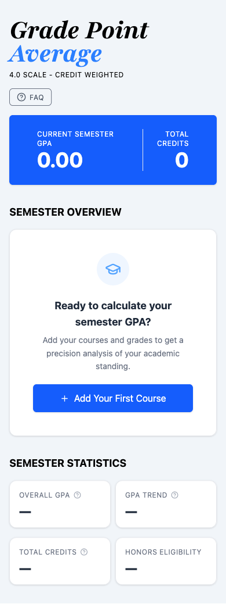
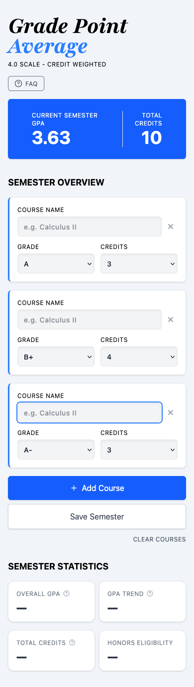
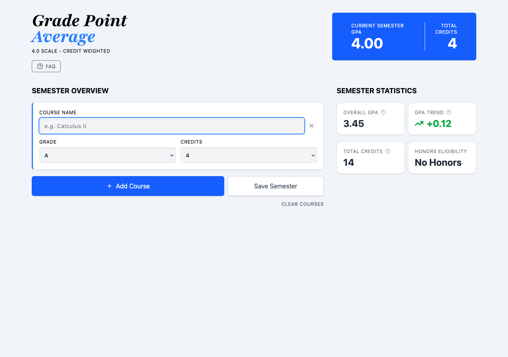

# GPA Calculator

A clean, weighted GPA calculator built with React and TypeScript, featuring a responsive UI styled with Tailwind CSS.

## Tech Stack

- **React** – Component-based UI with hooks (`useState`, `useEffect`, `useRef`)
- **TypeScript** – Fully typed components, props, and utility functions
- **Vite** – Fast dev server and build tooling
- **Tailwind CSS v4** – Utility-first styling configured entirely via `@theme` in `index.css`
- **Radix UI** – Accessible, unstyled UI primitives (Accordion, Tooltip)
- **Lucide React** – Lightweight icon set

## Features

- Add multiple courses with name, letter grade, and credit hours
- Weighted GPA calculation based on the 4.0 scale
- Live GPA display that updates as you add or edit courses
- Delete individual courses or clear all at once
- Save completed semesters to track cumulative GPA over time
- **Semester Statistics panel** with four stat cards:
  - Overall GPA across all saved semesters
  - GPA Trend — shows whether the current semester raises or lowers your cumulative GPA
  - Total Credits earned across saved semesters
  - Honors Eligibility (Cum Laude, Magna Cum Laude, Summa Cum Laude)
- Tooltips on stat cards explaining each metric
- Responsive desktop layout with a two-column grid at `lg` breakpoints
- Empty state with a call-to-action when no courses have been added
- Autofocuses the course name input when a new course is added
- Accessible FAQ accordion explaining the GPA calculation method and honors cutoffs

## Live Demo

[tavion-gpa-calculator.netlify.app](https://tavion-gpa-calculator.netlify.app)

## Screenshots

### Empty state (mobile)


### Courses added (mobile)


### Desktop layout with semester statistics


## Project Structure

```
src/
├── components/
│   ├── CourseListItem.tsx       # Individual course row with inputs and delete button
│   ├── CoursesList.tsx          # Course list, add/clear/save controls, and empty state
│   ├── Faq.tsx                  # Accessible accordion FAQ for GPA calculation and honors info
│   ├── Header.tsx               # App title, scale info, and FAQ navigation button
│   ├── SemesterGpaDisplay.tsx   # Live GPA and credit readout for the current semester
│   └── StatCard.tsx             # Reusable stat card with optional tooltip (Overall GPA, Trend, Credits, Honors)
├── data/
│   └── faqs.tsx                 # FAQ content data
├── utils/
│   └── courses.ts               # Pure functions for GPA logic + Course/Semester interfaces
└── App.tsx                      # Root component, state management, view routing
```

## Getting Started

```bash
# Install dependencies
npm install

# Run dev server
npm run dev

# Build for production
npm run build
```
